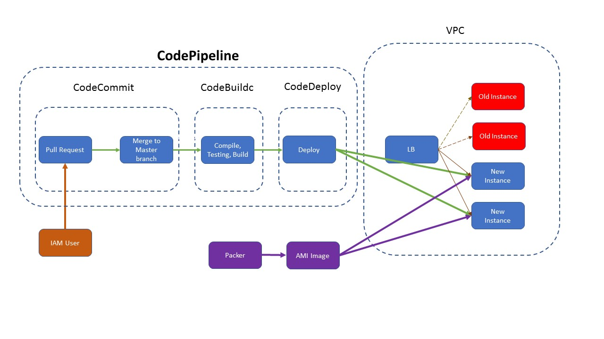

## Build Your Own CI/CD Pipeline in AWS

This repository contains instructions and resources (files, source code) for you to build your own CI/CD pipeline in AWS.

### AWS services and other technologies that been used:
Other technologies:
* Packer - A tool to build your own AWS AMIs
  * ansible-local: Packer provisioner
  * shell: Packer provisioner
* Ansible - Install packages on the remote server
* Boto3 - A AWS Python library/framework

AWS serviecs:
* IAM (Identity and Access Management)
  * IAM users creation
  * IAM groups creation
  * IAM roles creation
  * IAM policy creation
* S3 - Artifact storage
* CodeCommit - Code version control
* CodeBuild - Code testing, compile, packaging
* CodeDeploy - Artifacts deployment
* CodePipeline - Create CI/CD pipeline based on CodeCommit, CodeBuild and CodeDeploy

### AWS services and technologies will be used in the future:
* CloudWatch - CI/CD pipeline monitoring and notification
* CloudTrail - Account/User and application activity usage tacking
* KMS - Uesr data encryption

### Project goal:
After the implementation, you should have a working CI/CD pipeline in your AWS account. Whenever you merge a pull request into master, the CodePipeline should be automatically triggered and start building and packing new artifacts based on the changes. 

After new artifacts are built, they will be audo-deployed to new EC2 instances, old instanes that running old version of the application will be terminated after new version is successfully deployed, traffic will be re-route to the new instances.

### Project architecture/flowchart:

## Implementation steps:
1. [Create a AWS account](https://aws.amazon.com/free/?sc_channel=PS&sc_campaign=acquisition_US&sc_publisher=google&sc_medium=cloud_computing_b&sc_content=aws_account_p_control_q32016&sc_detail=create%20aws%20account&sc_category=cloud_computing&sc_segment=102882714042&sc_matchtype=p&sc_country=US&s_kwcid=AL!4422!3!102882714042!p!!g!!create%20aws%20account&ef_id=WiBbmgAABHt7gARB:20180122215959:s)
2. [Create a "Developers" Group in IAM](https://docs.aws.amazon.com/IAM/latest/UserGuide/id_groups_create.html) with the following policies:
  * AmazonEC2FullAccess
  * AWSCodeCommitFullAccess
  * IAMFullAccess
  * AmazonS3FullAccess
  * AWSCodeDeployFullAccess
  * AWSCodeBuildAdminAccess
3. [Create a user "test" in "Developers" group](https://docs.aws.amazon.com/IAM/latest/UserGuide/id_users_create.html) and make sure you enable MFA, and also create "Access Key" for this user.
4. Build your own AMI by using packer. The AMI will be used as base AMI when we spin up new EC2 instances. Check `packer` folder for detailed instructions.