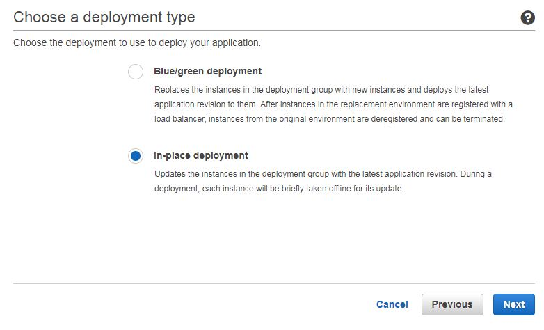

## How to Deploy Code to a AWS EC2
1. Prepare a SSH key pair with AWS EC2.
2. Instead of creating your own VPC, autoscaling group, security group, load balancer, ..etc. We will take the short path :). Since this is only a CodePipeline demo, we let AWS handle all of that. So we will let AWS create the full stack for us, then simply use the stack to deploy our own applcation.

### Steps:
Go to AWS CodeDeploy in your AWS console:
1. Choose Sample Deploy

2. Choose a deploymen type

3. Create a blue/green deployment

4. After environment is ready, just let it deploy. You can check the status under "AWS CodeDeploy" -> "Deployments".
5. Once the sample-deployment finish, you should have a application called "MoviesDBProjApp" under "Application" tab.

6. Click on it, you should see an existing deployment group.

7. Now Go ahead and create a new deployment, this time use your own artifact and click deploy.
